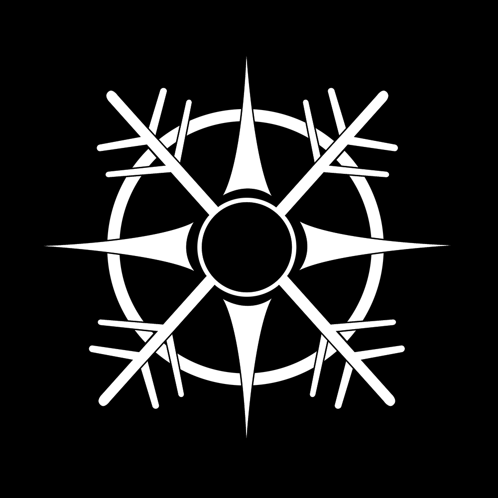

    

        <h1>PROJECT YUKI ENGINE</h1>
        
         
        Yuki Engine
         
        ~~~ Logo designed by Arisu ~~~
    
 

# Về Yuki Engine

## Yuki Engine là gì?

Yuki Engine là một engine game được viết nên để thực hiện hoá giấc mơ của tôi. Chỉ thế thôi <3.

## Tại sao lại là `Yuki`?

Ở Việt Nam nơi tôi sống - một đất nước ở vùng nhiệt đới gió mùa, tuyết thường không bao giờ rơi. Nó biểu trưng cho khát vọng chạm tới ước mơ của tôi (và nó màu trắng 🤣). Một ước mơ có thể tạo ra một tựa game - một thế giới mới bằng chính bàn tay này. Liệu rằng ước mơ có thể trở thành hiện thực? Thay vì đặt câu hỏi mà chưa tìm ra lời giải. Tôi đã bắt đầu, và `Yuki Engine` là điểm bắt đầu cho cuộc hành trình này.

## Tại sao không sử dụng các engine có sẵn như `Unity`, `Unreal`?

Một câu trả lời đơn giản, tôi muốn là chính tôi ❤️ (và thực tế là cần học nhiều thứ nữa như vẽ, làm nhạc,... tôi chưa đủ sẵn sàng để làm ra một game).

## Về bản thân tôi?

Một người trẻ với ước mơ viển vông và có khát vọng biến nó thành sự thật ❤️, một kẻ trải qua vô số thất bại và chưa một lần thành công 😌.

## Về logo?

Một người bạn tốt bụng đã làm nó ❤️.

## Liên hệ với tôi.

> KHÔNG CÓ 😌

# Về những thứ có trong Yuki Engine.

## Công nghệ

- Yuki Engine sử dụng API chính là OpenGL để giao tiếp với GPUs.
- GLFW đóng vai trò Window manager vì nó khá thích hợp với vulkan.
- GLM được sử dụng cho các tính toán ma trận, vector,... (cũng vì nó thích hợp với vulkan và dễ dùng).
- Project manager được sử dụng là Visual Studio 2022 và vcpkg

## Cài đặt và viết code

### Yêu cầu:

- Visual Studio 2022

### Mở `Yuki.sln` và boom 😌
